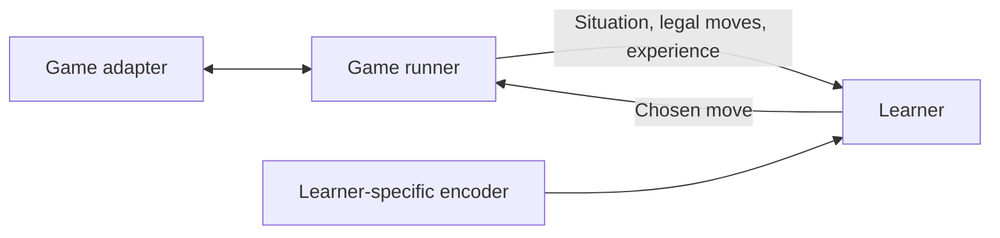

# XCS game-learning design

This document records the proposed approach for learning to play games with a
learning classifier system (LCS). The initial learner is multi-step XCS. Game rules
and orchestration remain independent of XCS so that other learning methods can be
introduced later. The repository currently contains classifier building blocks;
the architecture and learning cycle below are not yet implemented end to end.

## Goals and starting assumptions

The intended applications include tic-tac-toe, checkers variants, and eventually
chess. Start with alternating-turn, two-player, zero-sum games with fully observable
game state and known rules. Online learning means updating knowledge from games as
they are played; it does not imply achieving strong play after a few games.

Reuse the learning algorithm across games, with a game-specific adapter for each
ruleset. The starting assumption is a separate trained population and feature
layout for each game and board size. Sharing an implementation does not imply
automatic transfer of learned knowledge between games or board sizes.

## Responsibilities and extension boundaries



| Part | Responsibility |
| --- | --- |
| Game adapter | Own the complete game state, identify the player to move, enumerate legal moves, apply moves, and determine results. |
| Game runner | Coordinate players, record actual moves and outcomes, and report episode completion. |
| Learner | Choose moves and manage its own learning procedure and learned model. Initially this is XCS. |
| Learner-specific encoder | Map a game's state and moves to the representation required by a particular learning method. |

The shared boundary carries game-domain states and moves, player identities,
legal moves, experience, and terminal results. Classifiers, match sets, action
sets, and population management belong inside the XCS learner. In particular,
the game's adapter should not depend on the current classifier `SampleData` or
`Action` types.

Encoding is specific to the combination of game and learning method. A future
neural learner may use tensors where XCS uses categorical attributes. Encoded
action identifiers must remain stable across situations; a move's position in
the current legal-move list is not a stable identifier. The encoder must map the
selected identifier back to exactly one currently legal domain move.

The runner reports what happened without imposing XCS's update equations or
transition grouping on every learner. A future learner may collect complete
episodes, retain method-specific decision information, or train in batches.
Learning must be separable from evaluation so that evaluation games can use a
fixed model without exploration or population changes.

Game rules should support applying a move to an independent state without
modifying the live game or triggering learning. A future search-based player can
use that capability to examine hypothetical continuations. The same adapter can
then serve XCS, a neural agent, or a learner combined with search.

## What XCS learns

A classifier consists of a condition, a proposed action, and learned metadata.
Its condition describes situations where its prediction applies. For example, a
tic-tac-toe rule could constrain two cells to contain the player's marks and a
third to be empty, propose playing the third cell, and ignore other cells.

The three main learned quantities have different meanings:

| Quantity | Meaning |
| --- | --- |
| Prediction | Estimated future return when taking the action in matching situations. |
| Prediction error | Estimated discrepancy between the prediction and learning targets. |
| Fitness | Reliability derived from prediction accuracy relative to competing rules. |

A rule that reliably predicts a loss can have high fitness. Keeping accurate
knowledge about bad moves helps the learner avoid them. Fitness is not simply
the reward received by a rule. This distinction is central to
[Wilson's original XCS paper](#references).

Experience counts updates, numerosity counts represented copies, and an action-set
size estimate supports population management. A genetic-algorithm timestamp
tracks when a rule last participated in evolution. These quantities support
learning and evolution rather than directly defining the value of a move.

## XCS learning cycle

The baseline mechanics follow [Butz and Wilson](#references):

1. **Match:** collect population rules whose conditions match the current input.
2. **Cover:** generate matching rules when action representation is insufficient.
3. **Predict:** compute each represented action's fitness-weighted mean prediction.
4. **Choose:** balance exploitation of high predicted return with exploration.
5. **Update:** adjust the executed action's rules using a temporal-difference
   target; update prediction, error, fitness, experience, and action-set estimates.
6. **Evolve:** periodically select parents within an action set, cross and mutate
   offspring, and maintain a bounded population. Subsumption can consolidate
   sufficiently accurate, experienced rules.

For this game's integration, only currently legal moves participate in selection,
covering, and the next-state maximum used in learning. Condition matching alone
does not establish legality. New or mutated rules must never bypass the adapter's
legal-move restrictions.

For the initial small-game design, we recommend representing every current legal
move before choosing an action, covering missing ones. Population capacity must
accommodate that policy; a fixed covering target larger than the number of legal
moves is invalid. Scaling coverage to games with many moves remains a later
design decision.

Use epsilon-greedy exploration as the starting policy: sometimes choose uniformly
from legal moves, otherwise choose a move with the highest prediction, breaking
ties randomly. Its exploration probability and schedule remain to be chosen.

## Credit assignment across alternating turns

Our proposed adaptation groups an XCS learning transition from one player's
decision to that same player's next decision, including the opponent's response:

```text
My situation -> my move -> opponent's response -> my next situation
```

Let `Q(s, a)` be XCS's combined prediction for action `a` in situation `s`. The
target for the rules supporting the earlier chosen action is:

```text
terminal:      target = reward
nonterminal:   target = reward + gamma * max(Q(nextState, nextLegalMove))
```

Both reward and next-state predictions use the transition owner's perspective.
`gamma` discounts once between successive decisions by that player, not once per
individual board move. This convention avoids accidentally maximizing the
opponent's return. A future design that learns after every individual move would
need a different, explicitly defined treatment of player perspective.

Recommended starting rewards are `+1` for a win, `0` for a draw, `-1` for a loss,
and `0` for a nonterminal transition. Keep terminal status separate from reward:
a terminal draw has no future-value term even though its reward is zero.

When either player's move ends the game, complete the pending learning transition
for both players that have one. The losing player may never receive another turn.
For example, if my opponent wins immediately after my move, my pending action
receives a terminal target of `-1`.

Each player needs its own pending decision and action-set context. This remains
true if both seats later share a learned population. The runner should still
record individual moves; forming these same-player transitions is the XCS
learner's responsibility.

## Board state and history

Distinguish the complete game state from the attributes visible to the learner.
The adapter must retain every fact needed for correct move generation and
termination, including historical facts required by that game's rules. Search
must receive enough state to reproduce those rules in hypothetical positions.

The starting XCS representation is a fixed-length categorical vector for each
game and board size: board contents plus selected contextual attributes. Pieces
can be encoded relative to the acting player as `self` and `opponent`. Any board
rotation or reflection used for encoding must transform moves consistently.

Retain the move history as structured game data. Do not append an unbounded move
history to the XCS feature vector: the existing conditions require equal input
and condition lengths. Use rule-relevant summaries, or a bounded history window
when useful. A bounded window is not a substitute for the adapter's exact
history-dependent rule state.

If distinct situations with different consequences map to identical features,
the learner loses information it may need. Thus a compact encoding is a design
tradeoff, not a guarantee that board contents alone are sufficient.

## Relationship to the current code

Existing pieces already support categorical samples, conjunctions of `Any` and
`OneOf` matchers, condition-action classifiers, match-set grouping, and action-set
construction. `CoveringService` generates a rule that matches a supplied sample
and uses a caller-supplied action.

These are building blocks rather than a complete XCS implementation.
`ActionSetService` assembles rules for an action that has already been chosen; it
does not implement exploration or prediction-based choice. Covering does not
itself know whether an action is legal. `App` starts Spring, and
`LearningClassifierSystem.run` is empty. Game adapters, the population lifecycle,
prediction aggregation, reward updates, evolution, and evaluation are still to
be implemented.

Some existing metadata choices need review before implementation. The initial
prediction is currently `10.0`, so initialization and error thresholds need to be
considered alongside the proposed reward scale. The current integer
`actionSetSize` would not directly represent a fractional learned estimate.
Neither point is changed by this document.

## Validation direction, limitations, and open choices

Start by validating learning on tic-tac-toe against a fixed opponent and evaluating
a frozen model against a perfect minimax opponent. Then investigate a precisely
defined checkers variant before attempting chess. Fixed opponents help separate
learning behavior from the changing behavior of another learner; self-play can
be introduced once the baseline is understood.

Useful correctness scenarios include rejection of illegal moves, learning a
terminal loss after an opponent's move, terminal draws without bootstrapping,
separate pending contexts for both players, and consistent state/move encoding.
Reproducible seeds and evaluation across multiple runs will be needed to assess
learning performance. The current covering service uses `ThreadLocalRandom`, so
reproducibility needs deliberate support later.

More computation alone does not establish that this representation will scale to
strong chess. Large action spaces, long-delayed rewards, and limited spatial
generalization remain research challenges. Experience replay is an optional
extension, not an assumed improvement: [Stein et al.](#references) report that it
can aggravate XCS difficulties in sequential tasks with long action chains.

Population size, learning rate, discount factor, error thresholds, exploration
schedule, genetic operators and their rates, and subsumption settings remain
open. The current covering probability is `0.1`; it is an existing configuration,
not a validated game-playing choice. Additional representations, search, and
alternative learning backends can be evaluated without moving their mechanics
into the game adapters or runner.

## References

1. **Stewart W. Wilson (1995), _Classifier Fitness Based on Accuracy_.**
   *Evolutionary Computation*, 3(2), 149-175.
   [Author-hosted full text](https://www.eskimo.com/~wilson/ps/xcs.pdf) ·
   [DOI](https://doi.org/10.1162/evco.1995.3.2.149).
   Introduces XCS and explains why fitness measures prediction accuracy. The
   original uses match-set genetic-algorithm niches; use the later algorithm
   description below for the action-set formulation discussed here.

2. **Martin V. Butz and Stewart W. Wilson (2002), _An Algorithmic Description of
   XCS_.** *Soft Computing*, 6, 144-153.
   [Publisher article](https://link.springer.com/article/10.1007/s005000100111).
   The main reference for XCS structures, parameters, and algorithmic steps. It
   should be distinguished from the earlier April 2000 technical report and the
   improved 2001 workshop chapter. Our legal-action restrictions, player-specific
   transitions, and game architecture are proposed adaptations, not claims that
   this paper specifies a board-game framework.

3. **Anthony Stein, Roland Maier, Lukas Rosenbauer, and Jörg Hähner (2020), _XCS
   Classifier System with Experience Replay_.** arXiv:2002.05628.
   [Paper and full text](https://arxiv.org/abs/2002.05628).
   Investigates replay, reports sample-efficiency benefits in single-step tasks,
   and discusses limitations in longer sequential tasks. Useful when deciding
   which extensions to test; it does not establish competitive chess performance.
