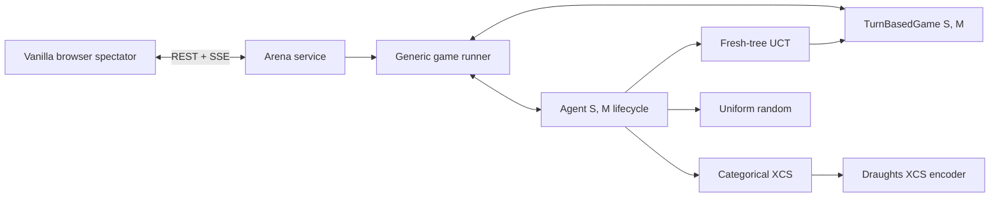

# LCS spectator arena design

The application is a local spectator arena for experiments in online game
learning. Its first learning method is a conventional categorical XCS baseline,
and its first game is 10×10 international draughts. The boundaries carry domain
states, legal moves, decisions, transitions, and outcomes, so a method can be
added without putting its mechanics into the game engine or runner.

The arena is deliberately an experiment, not a claim that XCS will become a
strong draughts player. It makes the learning process visible and compares a
changing policy with stationary UCT and random baselines.

## Running it

The project requires Java 25. Start the local server with:

```shell
./gradlew :app:bootRun
```

Then open <http://127.0.0.1:8080>. A run exists only in memory. Starting a new
run replaces the previous stopped run, and restarting the process clears all
models, games, and statistics.

Run the verification suite and formatting checks with:

```shell
./gradlew :app:test :app:spotlessCheck
```

## Architecture


```mermaid
flowchart LR
    UI[Vanilla browser spectator] <-->|REST + SSE| Arena[Arena service]
    Arena --> Runner[Generic game runner]
    Runner <--> Game[TurnBasedGame S, M]
    Runner <--> Agent[Agent S, M lifecycle]
    Agent --> XCS[Categorical XCS]
    Agent --> MCTS[Fresh-tree UCT]
    Agent --> Random[Uniform random]
    XCS --> Encoder[Draughts XCS encoder]
    MCTS --> Game
```

`TurnBasedGame<S, M>` defines only the rules needed by a game-playing method:
initial state, player to move, legal actions, immutable action application, and
an optional rules-level outcome. `DraughtsGame` owns all FMJD rules and history.

`Agent<S, M>` defines episode start, decision, transition observation, episode
end, frozen copying, and telemetry. `DecisionContext` always includes the exact
domain state and its legal moves. `AgentDecision` carries a typed trace so the
UI can show XCS predictions, MCTS root visits, or the random policy's choice set.

`GameRunner` validates every selected move against the supplied legal list,
records the episode, sends each transition to both competitors, and completes
both episode lifecycles with seat-relative rewards. Its 1,000-ply arena limit is
a safety failure: it is never converted into a draw or learning reward.

This split keeps likely future methods isolated. A neural policy can introduce
its own tensor encoder; another search can consume the same immutable game
state; and a new game can implement the shared rules interface. None needs to
depend on XCS match sets or draughts bitboards.

## International draughts state and rules

The implementation follows the [FMJD Annex 1 official rules, 2024
edition](https://www.fmjd.org/downloads/FMJD_Annexes_2024_8-sig.pdf):

- The board has 50 numbered playable squares and starts with 20 men per side.
  White moves first.
- Men move quietly forward and capture in both directions. Kings move and
  capture along any distance of an unobstructed diagonal.
- A capture is mandatory, and a player must choose a sequence taking the
  maximum number of pieces. There is no king priority; all equal maximum paths
  remain legal.
- A whole multi-capture path is one `DraughtsMove`: origin, ordered landings,
  and ordered captured squares. Captured pieces remain blockers until that path
  ends and cannot be captured twice. Previously crossed empty squares may be
  crossed again.
- A man promotes only when the complete action ends on its promotion row.
  Passing through that row during a capture does not promote it mid-action.
- A player with no piece or no legal move loses.
- Draw state is exact: third occurrence of the same position with the same side
  to move; 25 qualifying king-only moves by each player without a man move or
  capture; and the FMJD five- and sixteen-move material endings. The special
  clocks can overlap after a capture, and the sixteen-move clock can receive the
  five-move long-diagonal extension (the timing interpretation remains
  [an audit limitation](verification.md#rule-interpretation-still-requiring-confirmation)). A win completed on the last allowed move
  takes precedence over the draw clock.

Four 50-bit bitboards store white men, white kings, black men, and black kings.
States are immutable. Reversible moves append an exact position signature to a
persistent linked repetition history, sharing its older structure; a man move
or capture starts a fresh repetition window. Stable action IDs contain the full
capture path and captured squares. Learned IDs are resolved only through the
current legal-action map.

## XCS representation

The XCS input is a fixed categorical vector from the acting competitor's point
of view. Its first 50 attributes are one of:

```text
EMPTY · SELF_MAN · SELF_KING · OPPONENT_MAN · OPPONENT_KING
```

Black observations rotate square `n` to `51 - n`; moves receive the same
rotation. Context attributes record the side to move, the full actor-relative occurrence
map for the current reversible repetition window,
both 25-move counters, and exact actor-relative state for each active five- and
sixteen-move clock. Keeping these clocks in the observation avoids aliasing
positions with different imminent draw consequences.

Each classifier has a ternary-style categorical condition (exact current value
or wildcard), a stable action ID, and the conventional learned values:

| Quantity | Meaning |
| --- | --- |
| Prediction | Expected discounted return after choosing the action. |
| Prediction error | Moving estimate of absolute target discrepancy. |
| Fitness | Relative accuracy inside an action set. |
| Experience | Number of learning updates. |
| Numerosity | Number of micro-classifiers represented by this rule. |
| Action-set size | Learned estimate used in deletion pressure. |

A prediction is not a win probability. A low prediction error is not a generic
confidence score. A wildcard says that one classifier ignores an attribute; it
does not prove that the attribute is irrelevant to the task.

### Decision and update cycle

At a decision, XCS performs these steps:

1. Match conditions and discard rules whose action is not currently legal.
2. During training, cover every legal action that has no matching rule. If the
   population cap cannot hold all legal representations without deleting an
   active or pending rule, stop the run with a visible capacity error.
3. Compute each action prediction as the fitness-weighted mean of its matching
   rules. In a frozen model, an unknown legal action has prediction zero and is
   marked unknown; frozen models never cover.
4. Choose epsilon-greedily from legal actions, with seeded random tie-breaking.
5. Keep the chosen action set pending until this competitor acts again or the
   episode ends.

The nonterminal target spans the opponent's reply and returns to the same
competitor's perspective:

```text
target = gamma × max prediction(next own turn, next legal actions)
```

Terminal pending sets receive `+1` for a win, `0` for a draw, and `-1` for a
loss. Both competitors are completed even when the loser never receives another
turn. There is no shaping reward or replay buffer in this baseline.

The update computes error from the old prediction before changing prediction.
For early experience it uses the sample-average rate `1 / experience`, switching
to `beta` at the conventional threshold. Accuracy-relative fitness and the
fractional action-set-size estimate are then updated. The action-set genetic
algorithm runs after the learning update.

### Genetic algorithm and population safety

Parents are selected by fitness roulette within the earlier action niche.
Offspring receive fresh, stable rule IDs and record both parent IDs. Two-point
crossover exchanges condition segments. Condition mutation toggles between a
wildcard and the niche state's current value, preserving match membership;
action mutation chooses another legal action from that niche. A mutation event
is a candidate change, not evidence of an improvement.

Deletion uses conventional action-set-size votes with low-fitness pressure and
reduces numerosity before deleting a macro-classifier. Pending and active rule
IDs are protected. GA subsumption is enabled; action-set subsumption is kept off
for the baseline. The UI retains population events and a bounded last-50 change
history for inspected rules.

The default parameters follow the baseline described by Butz and Wilson:

| Parameter | Default |
| --- | ---: |
| Population cap `N` | 1,000,000 micro-classifiers (arena range: 500–1,000,000) |
| Learning rate `beta` | 0.2 |
| Discount `gamma` | 0.99 |
| Exploration `epsilon` | 0.2 |
| Accuracy falloff `alpha` | 0.1 |
| Error threshold `epsilon0` | 0.01 |
| Accuracy power `nu` | 5 |
| Covering wildcard probability | 0.33 |
| Initial prediction / error / fitness | 0 / 0 / 0.01 |
| GA threshold | 25 |
| Crossover probability | 0.8 |
| Mutation probability | 0.04 |
| Deletion experience / fitness fraction | 20 / 0.1 |
| Subsumption experience | 20 |
| GA / action-set subsumption | on / off |

All stochastic operations receive an explicit seeded generator. The older
classifier building blocks also use an injected generator rather than
`ThreadLocalRandom`.

## Baselines

The UCT agent builds a fresh tree for every real move. It uses exploration
constant `sqrt(2)`, uniform expansion, uniform rollouts on the official game
state, and backs values up from the perspective of the player who chose each
edge. It selects the root move with the most visits, using the seeded generator
for ties. A rollout still unresolved after 500 plies returns neutral value zero
and increments truncation telemetry.

The available simulation presets are Fast (100), Balanced (500, default), and
Strong (2,000). The random baseline samples uniformly from the legal list. Both
are stationary: their telemetry changes, but they do not learn between games.

## Training, evaluation, and reproducibility

Only one run can be active. Each run constructs fresh competitors from its
configuration and master seed. Competitor identity stays fixed as A or B while
colors alternate every training game.

When a learner is present, training pauses every 500 completed training games
by default. The arena deep-copies both policies into frozen competitors and
plays 20 evaluation games with alternating colors. XCS evaluation disables
exploration, covering, updates, and the genetic algorithm; unknown legal actions
remain visible at value zero. Evaluation uses a separately derived random stream
and never changes the live population. Evaluation results and training results
are reported separately.

Live pacing waits 600 ms after each observed move. Turbo has no delay and emits
bounded status updates; replay controls animate retained games. Pause takes
effect after the current agent decision. Stop interrupts MCTS searches and
otherwise takes effect at the next decision boundary. A stopped or failed run
remains inspectable until a new run replaces it.

Population metrics and evolution highlights refresh after each training move, so
paused runs remain inspectable before their first game completes. Stopped and
failed runs capture the final learning state, including capacity failures.
Learning charts still sample completed training games.

The run keeps exact lifetime totals and a rolling window of 100 training games.
Memory-heavy detail is bounded:

| Data | Retention |
| --- | ---: |
| Chart samples | 2,048 per series, with older adjacent samples compacted |
| Full game replays | Last 20 |
| Evolution highlights | Last 200 |
| Inspected rule changes | Last 50 per rule |

## HTTP surface

The vanilla HTML/CSS/JavaScript client is served by Spring Boot and has no CDN or
frontend build. It uses these endpoints:

| Method | Path | Purpose |
| --- | --- | --- |
| `GET` | `/api/arena/options` | Agent presets, advanced settings, and defaults |
| `POST` | `/api/arena/runs` | Start a fresh run; returns 409 while one is active |
| `GET` | `/api/arena/runs/current` | Authoritative snapshot for initial load/reconnect |
| `POST` | `/api/arena/runs/current/pause` | Pause after the current decision |
| `POST` | `/api/arena/runs/current/resume` | Resume a paused run |
| `POST` | `/api/arena/runs/current/stop` | Stop after the current decision |
| `PATCH` | `/api/arena/runs/current/pacing` | Switch between Live and Turbo |
| `GET` | `/api/arena/runs/current/events` | SSE notifications with monotonic IDs |
| `GET` | `/api/arena/runs/current/replays/{gameNumber}` | A retained full replay |
| `GET` | `/api/arena/runs/current/competitors/{id}/rules/{ruleId}` | Rule inspector data |

The UI shows the animated board, cumulative and rolling results, evaluation
series, game length and throughput, XCS population metrics, decision evidence,
population events, rule anatomy, and replay controls.

## Verification

The test suite covers game-runner lifecycle and safety failures; FMJD capture,
promotion, repetition, and draw-clock edge cases; actor-relative encoding and
action resolution; XCS covering, updates, evolution, capacity safety, freezing,
and fixed-seed determinism; UCT legality, forced wins, chooser-perspective
backup, visit accounting, rollout truncation, and determinism; bounded arena
history; and live Spring MVC/static/SSE endpoints.

NullAway checks every `@NullMarked` main package through Error Prone, ArchUnit
ensures new packages remain null-marked, and Spotless applies Google Java Format.

## Scope

This version intentionally has no persistence, concurrent runs, human player,
other draughts variants, neural policy, search-assisted XCS, or learned transfer
between runs. Those can use the method-neutral boundaries if experiments justify
them.

## Research references

1. Stewart W. Wilson (1995), *Classifier Fitness Based on Accuracy*.
   [Author-hosted paper](https://www.eskimo.com/~wilson/ps/xcs.pdf) ·
   [DOI](https://doi.org/10.1162/evco.1995.3.2.149). Introduces XCS and its
   accuracy-based fitness model.
2. Martin V. Butz and Stewart W. Wilson (2002), *An Algorithmic Description of
   XCS*. [Full technical-report PDF](https://www.researchgate.net/profile/Martin-Butz/publication/2937494_An_Algorithmic_Description_of_XCS/links/559117ac08ae47a3490efd8b/An-Algorithmic-Description-of-XCS.pdf) ·
   [publisher page](https://link.springer.com/article/10.1007/s005000100111).
   This is the baseline for update, GA, deletion, and subsumption mechanics; the
   legal-action and alternating-player integration here is game-specific.
3. Levente Kocsis and Csaba Szepesvári (2006), *Bandit Based Monte-Carlo
   Planning*. [Paper PDF](https://sites.ualberta.ca/~szepesva/papers/ecml06.pdf).
   Introduces UCT, used by the stationary search baseline.
4. *Learning Classifier Systems for Board Games: A Case Study with 6×6
   Checkers* (2021). [Springer chapter](https://link.springer.com/chapter/10.1007/978-981-16-3067-5_54).
   A useful nearby empirical study rather than evidence that this representation
   scales automatically to full international draughts.
5. Anthony Stein, Roland Maier, Lukas Rosenbauer, and Jörg Hähner (2020), *XCS
   Classifier System with Experience Replay*.
   [arXiv full text](https://arxiv.org/abs/2002.05628). Motivates keeping replay
   outside this baseline until its effect on long sequential tasks is measured.
